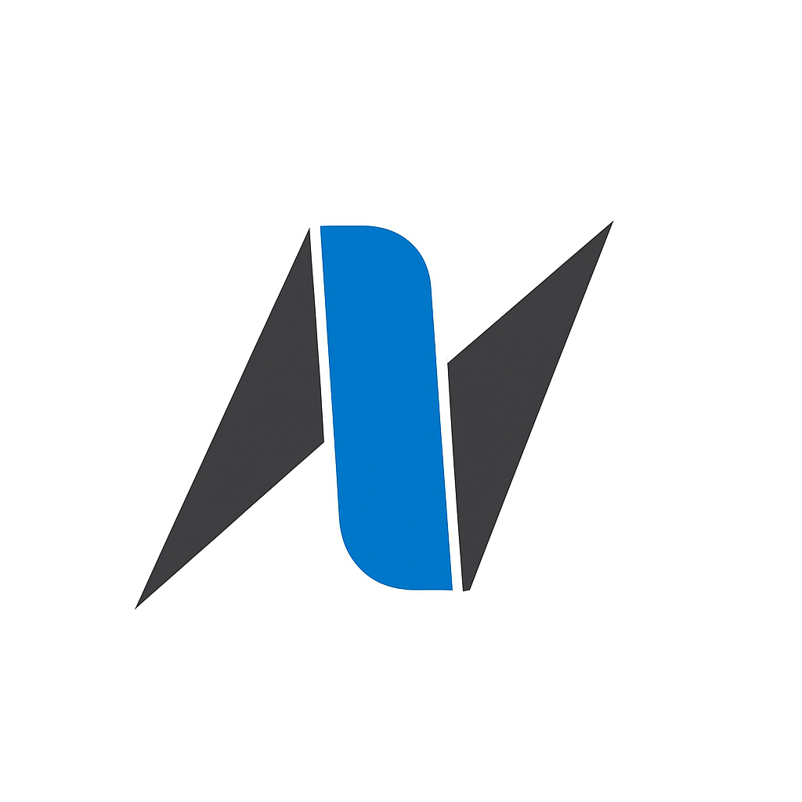

  

# The NexStep Network

  <h3><em>Where Ambition Meets Action</em></h3>
  
  
  
  

---

## 🚀 About The NexStep Network

The NexStep Network is a premier, student-led nonprofit organization fostering a dynamic ecosystem of **800+ technology professionals**, students, freelancers, and industry veterans. We serve as an international catalyst for ambitious individuals seeking to transform their careers and make meaningful impact in the technology sector.

Our community transcends traditional networking—we're a launchpad for innovators, builders, and visionaries who demand excellence and extraordinary opportunities.

## 🎯 What We Offer

### 🔥 Exclusive Opportunities

- **Premium Internships & Positions**: Access to unlisted opportunities from our partner network
- **Direct Industry Connections**: Fast-track access to hiring managers and decision-makers

### 📚 Learning & Development

- **Expert-Led Sessions**: Regular workshops with industry leaders from AI, startups, and emerging tech
- **Curated Learning Paths**: Daily-updated roadmaps designed for rapid skill acquisition
- **Mentorship Programs**: Direct access to senior professionals and industry veterans

### 🤝 Community & Collaboration

- **Strategic Networking**: Connect with motivated peers, entrepreneurs, and thought leaders
- **Project Collaboration**: Team up on real-world projects that matter
- **Cross-Disciplinary Support**: Excellence across AI, development, design, business strategy, and beyond

### 🛡️ Professional Environment

- **Safe Learning Space**: Judgment-free environment for questions and knowledge sharing
- **Quality Content**: Curated discussions focused on career advancement and innovation
- **Inclusive Community**: Welcoming space for diverse backgrounds and perspectives

## 🎯 Our Mission

**Empowering the next generation of technology leaders** through strategic connections, continuous learning, and practical career advancement opportunities.

We believe in action over observation—at The NexStep Network, members don't just consume content, they actively shape their future and contribute to meaningful technological progress.

## 🌐 Connect With Us

## 🏗️ Our Projects & Initiatives

### 🌟 Active Projects

| Project | Status | Description | Repository |
|---------|--------|-------------|------------|
| **Resource Website** | 🚧 Under Development | Comprehensive learning platform for members | [View Code](https://github.com/The-NexStep-Network/ResourceSite) |
| **Link Hub** | ✅ [Live](https://thenexstepnetwork.vercel.app/) | Centralized access portal for all community resources | [Source](https://github.com/The-NexStep-Network/Link-Site) |

---

  
<strong>Ready to take your next step?</strong>

  
Join The NexStep Network today and accelerate your journey in technology.

  
   
  
  <em>This repository and its projects are maintained by The NexStep Network Technology Team</em> 
  <em>Under the technical leadership of CTO @Syntax-Overlord</em>

